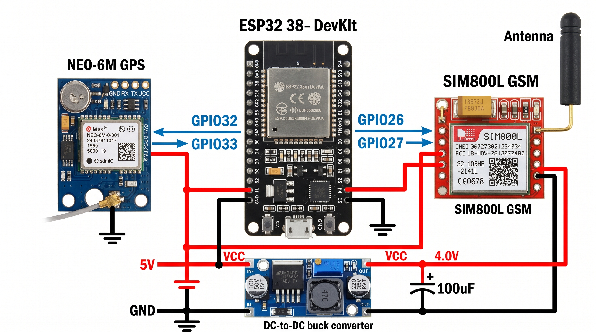

# ESP32 GPS/GSM Tracker

[](https://platformio.org/)
[](https://www.arduino.cc/)
[](LICENSE)

A production-oriented **IoT telemetry device** for remote GPS tracking with an ESP32, a GNSS receiver, and a SIM800-class GSM/GPRS modem. The firmware implements a compact embedded communication stack for real-time GPS acquisition, SMS-based diagnostics, and HTTP telemetry publishing over a GSM/GPRS transport layer.



## Project Overview

This repository demonstrates a senior-level embedded systems project structure for a cellular **remote tracking system**. The device continuously reads GPS NMEA data, maintains the latest validated position snapshot, and publishes telemetry to one or more backend endpoints through a fault-tolerant networking flow.

The project is designed for portfolio visibility and practical engineering review:

- Firmware is isolated under [`firmware/`](firmware/esp32_gps_gsm_tracker.ino).
- Documentation is separated under [`docs/`](docs/).
- Visual engineering assets are stored in [`assets/`](assets/).
- Build configuration is defined by [`platformio.ini`](platformio.ini).
- Sensitive deployment values are represented only by placeholders.

## Repository Layout

```text
.
├── assets/
│   └── system-architecture.png
├── docs/
│   ├── hardware-integration.md
│   ├── system-architecture.md
│   └── telemetry-protocol.md
├── firmware/
│   └── esp32_gps_gsm_tracker.ino
├── .gitignore
├── LICENSE
├── README.md
└── platformio.ini
```

## Features

- **Real-time GPS acquisition** through a dedicated ESP32 hardware UART.
- **Telemetry pipeline** that converts validated GPS fixes into backend-friendly HTTP payloads.
- **GSM/GPRS transport layer** using AT commands and TCP sockets.
- **Fault-tolerant networking** pattern with multiple configurable server endpoints.
- **SMS command support** for field diagnostics and on-demand location retrieval.
- UCS2 decoding support for modems or carriers that deliver SMS metadata in encoded form.
- Sanitized configuration defaults for APN, device ID, server host, backend IPs, and credentials.
- PlatformIO-ready project configuration for repeatable builds.

## Hardware Requirements

| Component | Recommended Role | Notes |
| --- | --- | --- |
| ESP32 development board | Main MCU | Uses UART1 for GSM and UART2 for GPS. |
| GPS/GNSS receiver | Positioning source | NMEA-compatible module supported by TinyGPS++. |
| SIM800/SIM900-class GSM modem | Cellular modem | Provides SMS and GPRS TCP/IP connectivity. |
| Active GPS antenna | GNSS reception | Strongly recommended for vehicle or enclosure deployments. |
| Cellular antenna | GSM/GPRS connectivity | Match antenna and modem frequency bands to local carrier. |
| SIM card with data/SMS plan | Network access | Disable SIM PIN before deployment. |
| Stable modem power supply | RF burst current | Cellular modems can draw high transient current during transmit. |
| Common ground wiring | Signal reference | ESP32, GPS, modem, and power supplies must share ground. |

## Pin Mapping

| ESP32 GPIO | Peripheral Signal | Direction | Firmware Constant | Engineering Notes |
| --- | --- | --- | --- | --- |
| GPIO32 | GPS TX → ESP32 RX2 | Input | `Pins::GPS_RX` | Receives NMEA sentences from the GPS receiver. |
| GPIO33 | GPS RX ← ESP32 TX2 | Output | `Pins::GPS_TX` | Optional GPS configuration channel. |
| GPIO26 | GSM TX → ESP32 RX1 | Input | `Pins::GSM_RX` | Receives modem AT responses and SMS notifications. |
| GPIO27 | GSM RX ← ESP32 TX1 | Output | `Pins::GSM_TX` | Sends AT commands, HTTP payloads, and SMS content. |
| GND | Common ground | Reference | N/A | Required for reliable UART communication. |

## Firmware Configuration

Before building a private deployment, update only the placeholder values in `firmware/esp32_gps_gsm_tracker.ino`:

```cpp
namespace TelemetryConfig {
constexpr const char* SERVER_HOST = "tracking.example.invalid";
constexpr const char* SERVER_IPS[] = {"192.0.2.10", "192.0.2.11"};
constexpr uint16_t SERVER_PORT = 22945;
constexpr const char* DEVICE_ID = "DEVICE_ID_PLACEHOLDER";
}

namespace CellularConfig {
constexpr const char* APN = "APN_PLACEHOLDER";
constexpr const char* APN_USER = "APN_USER_PLACEHOLDER";
constexpr const char* APN_PASS = "APN_PASSWORD_PLACEHOLDER";
}
```

Do **not** commit real APNs, production server IPs, credentials, SIM identifiers, authentication tokens, or unique device IDs. Use private build-time configuration, deployment notes, or a secrets management process for real deployments.

## GSM/GPRS Telemetry Explanation

The modem is managed through AT commands over UART1. During startup, the firmware disables command echo, checks modem registration, enables SMS text mode, and prepares live SMS notifications. For telemetry, the firmware initializes a PDP context using the sanitized APN placeholders, requests an IP address, and opens a TCP socket to each configured backend endpoint.

The HTTP payload is intentionally simple for constrained embedded deployments:

```text
/?id=DEVICE_ID_PLACEHOLDER&lat=LATITUDE&lon=LONGITUDE&timestamp=UNIX_TIME&speed=SPEED&bearing=0&altitude=ALTITUDE&accuracy=ACCURACY&batt=100
```

The GSM/GPRS transport layer sends this request with a configurable `Host` header and closes the socket after each publish cycle. Multiple backend IPs provide a basic fault-tolerant networking strategy when cellular routes or backend nodes are temporarily unavailable.

## GPS Data Pipeline Explanation

The GPS pipeline runs continuously in the main loop:

1. UART2 ingests raw NMEA characters from the GNSS module.
2. TinyGPS++ parses each sentence and updates fix validity, latitude, longitude, speed, altitude, HDOP, satellite count, date, and UTC time.
3. The firmware samples a `GpsTelemetry` snapshot when the publish interval expires.
4. Valid fixes are serialized into the telemetry pipeline.
5. If GPS date/time is valid and recent enough, the payload includes a Unix timestamp. Otherwise, the backend is expected to apply its receive timestamp.

This separation keeps real-time GPS acquisition independent from slower cellular network operations.

## SMS Command Support

The firmware supports an SMS control-plane command:

```text
location
```

When the command is received, the device replies with:

- Latitude and longitude.
- Speed in km/h.
- A Google Maps link for the latest fix.
- A satellite-searching status message if no valid fix is available.

This allows field technicians to verify device state without backend access and gives the remote tracking system an out-of-band diagnostic path.

## System Architecture

The system is divided into four engineering layers:

| Layer | Responsibility |
| --- | --- |
| Sensor acquisition | Reads GNSS data over UART and validates GPS fix quality. |
| Application firmware | Schedules telemetry, formats payloads, parses SMS commands, and manages state. |
| Embedded communication stack | Encapsulates modem AT commands, SMS handling, PDP setup, and TCP socket operations. |
| Backend integration | Receives HTTP telemetry and performs storage, visualization, alerting, or fleet tracking. |

Additional architecture notes are available in [`docs/system-architecture.md`](docs/system-architecture.md).

## Embedded Communication Workflow

```text
GPS module -> ESP32 UART2 -> TinyGPS++ parser -> telemetry snapshot
          -> HTTP query builder -> GSM UART1 AT commands -> GPRS TCP socket
          -> tracking backend

SMS command -> GSM modem -> ESP32 parser -> latest GPS fix -> SMS response
```

Operational sequence:

1. ESP32 initializes GPS UART2 and GSM UART1.
2. GSM modem is configured for SMS text mode and network registration checks.
3. GPRS is attached using APN placeholders supplied by the private deployment.
4. GPS acquisition runs continuously.
5. Every telemetry interval, the firmware sends a location payload to each configured endpoint.
6. SMS command handling remains active for on-demand location requests.

## Build and Upload

### PlatformIO

```bash
platformio run
platformio run --target upload
platformio device monitor -b 115200
```

### Arduino IDE

1. Install the ESP32 Arduino board package.
2. Install the TinyGPS++ library.
3. Open `firmware/esp32_gps_gsm_tracker.ino`.
4. Review and privately replace configuration placeholders.
5. Select the target ESP32 board and serial port.
6. Upload and open Serial Monitor at `115200` baud.

## Future Improvements

- Move deployment configuration into a private header generated from a template.
- Add TLS-capable modem support or signed payload authentication.
- Add battery voltage telemetry and low-power operating modes.
- Add watchdog recovery around modem attach, TCP send, and GPS stale-fix conditions.
- Add structured event logging for modem state transitions.
- Add configurable telemetry intervals and geofence-based reporting.
- Add CI checks for firmware formatting and PlatformIO builds.
- Add backend examples for Traccar, custom HTTP ingestion, or MQTT gateways.

## Security and Privacy Notes

- Treat GPS data as sensitive operational and personal information.
- Never publish production APNs, server addresses, device IDs, SIM details, or credentials.
- Confirm consent, privacy, telecom, and vehicle-tracking requirements before deployment.
- Use server-side authentication and rate limiting before accepting device telemetry publicly.

## License

This project is released under the MIT License. See [`LICENSE`](LICENSE) for details.
